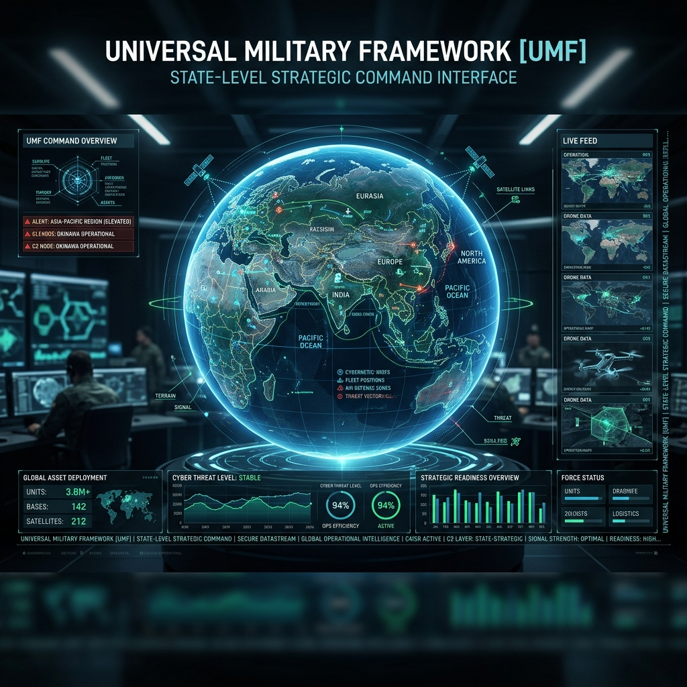
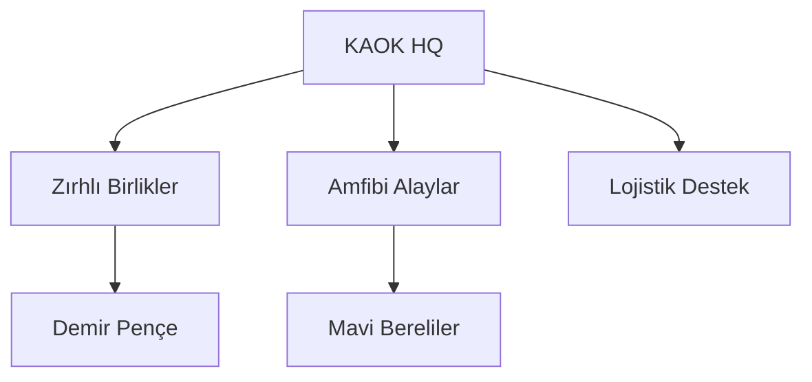
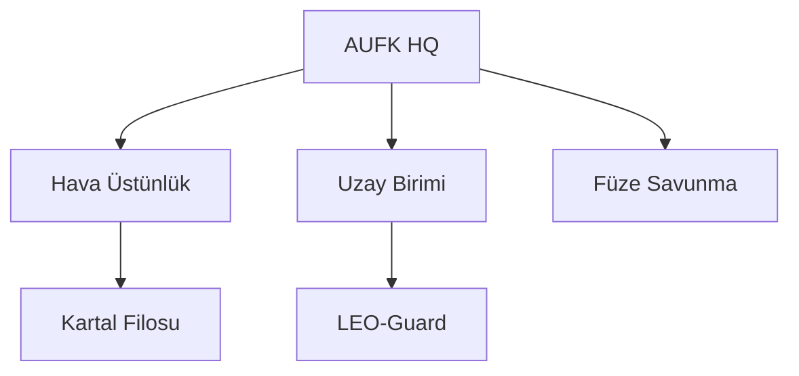
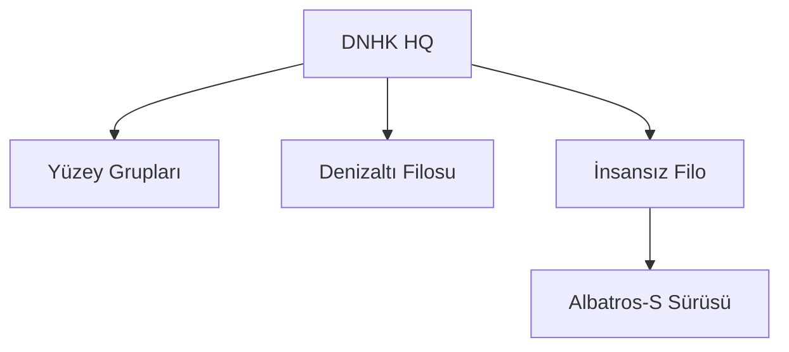
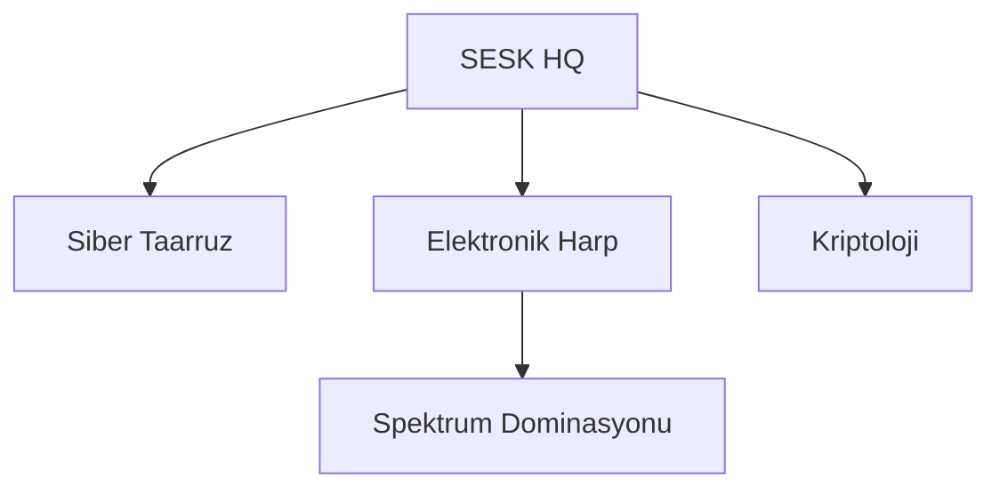
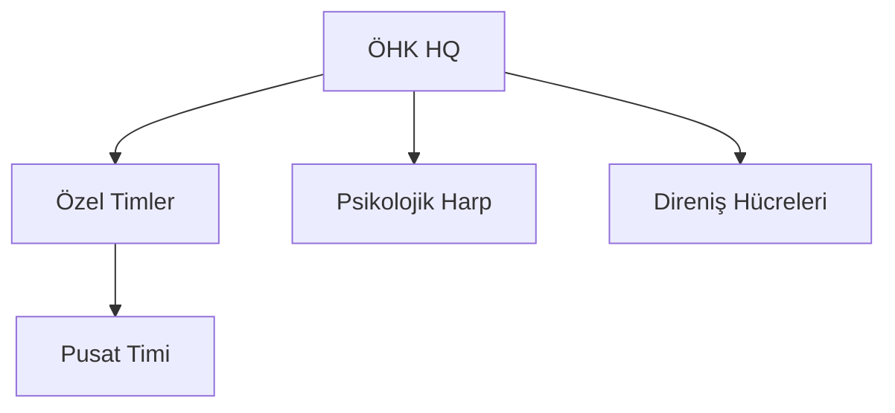
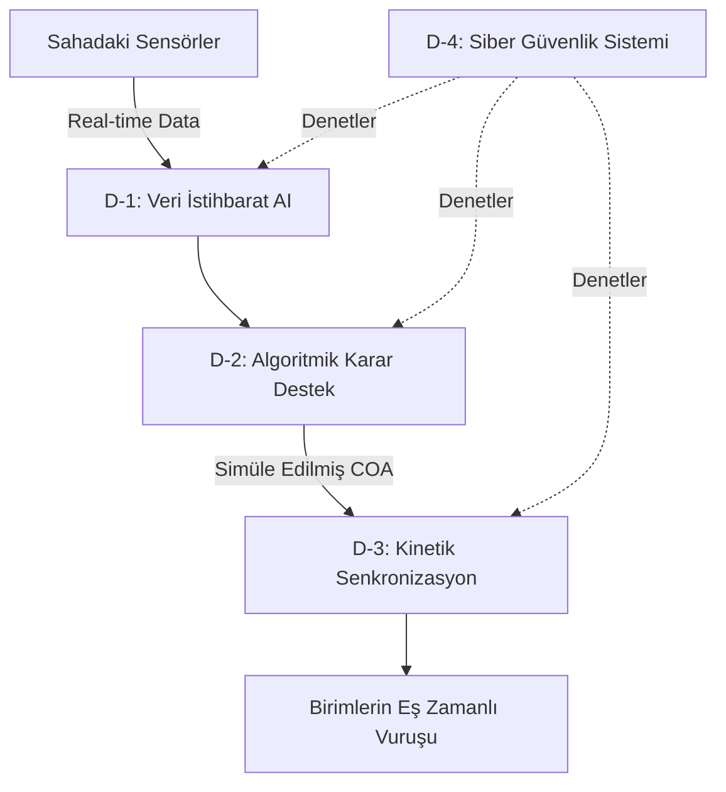

# 🪖 Universal Military Framework (UMF)
## ⟨ Milli Savunma Doktrini ve Algoritmik Egemenlik Protokolü ⟩
### ⟨ State Defense Doctrine & Algorithmic Sovereignty Protocol ⟩

---

### 🛡️ 1. Epistemik Vizyon (Epistemic Vision)
**Universal Military Framework (UMF)**, bir devletin beka stratejisini fiziksel, dijital ve kavramsal katmanlarda güvence altına almak için tasarlanmış **Bütünleşik Kuvvet Yapısı** (Integrated Force Structure) modelidir. 

#### 📄 Executive Summary
Modern savaş sahasının hantallıktan arındırılması, verinin kinetik güce dönüştürülmesi ve **Algoritmik Egemenlik** (Algorithmic Sovereignty) tesisi temel amaçtır. UMF, orduları klasik hiyerarşik yapılardan kurtarıp, veriyi bir mühimmat, askeri ise bir sensör olarak gören dinamik bir organizmaya dönüştürür.

---

### 🛡️ 1.5. Felsefi ve Epistemik Temeller (Philosophical Foundations)
UMF, sadece teknik bir protokol değil, aynı zamanda askeri varlığın doğasını sorgulayan bir "Epistemik Vizyon"dur. 
- **[Algoritmik Metafizik](philosophy/algorithmic-metaphysics.md)**: Savaş alanındaki varlığın veri tabanlı ontolojisi.
- **[Stratejik Zaman](philosophy/strategic-time.md)**: OODA döngüsünün fenomenolojik analizi ve zamanın daralması.
- [Öldürücülük Etiği](philosophy/strategic-time.md#öldürücülük-paradoksu-algoritmik-etik): Otonom sistemlerin moral sorumluluğu ve hibrit karar mekanizmaları.
- [Anlam Savaşı](philosophy/strategic-time.md#post-kinetik-varlık-anlam-savaşı): Kinetik vuruşun ötesinde bilişsel hakimiyet ve gerçeklik inşası.

---

### 🏛️ 2. Milli Savunma Yüksek Konseyi (MSYK)
Devletin en üst düzey stratejik ve politik karar mekanizmasıdır. 

| Alt Birim | Fonksiyon | Temel Çıktı |
| :--- | :--- | :--- |
| **Stratejik Planlama** | 10/20/50 Yıllık Projeksiyonlar | [MGSB (2026-2076)](council/mgsb-2026-2076.md) |
| **Kaynak Tahsis Komitesi** | Dinamik Bütçe Optimizasyonu | Operasyonel Verimlilik Katsayısı |
| **Jeopolitik Risk Odası** | Anlık Global Tehdit Analizi | Hazırlık Seviyesi (DEFCON) Ayarı |

---

### 📁 3. Operasyonel Teşkilatlanma: Beşli Güç Odakları (Operational Organization)
UMF, klasik hiyerarşi yerine "Ağ-Merkezli" (Network-Centric) çalışan beş ana komutanlık üzerinden organize edilir.

#### 3.1. Kara ve Amfibi Operasyonlar Komutanlığı (KAOK)
Toprak bütünlüğünün ve kıyı şeridinin mutlak koruyucusudur.
- **🛡️ Teşkilat Yapısı**:
    - **Demir Pençe Tugayı (Zırhlı)**: Yeni nesil otonom MBT ve ZPT'lerden oluşan ana vuruş gücü.
    - **Yıldırım Amfibi Alayı**: Kıyı başı tutma ve deniz-kara geçiş operasyonlarında uzmanlaşmış birlikler.
    - **Otonom Lojistik Tümeni**: "The Nerve" verisiyle çalışan sürü taşıma araçları.
- **🛠️ Ana Platformlar**: Altay-UMF (MBT), Ejder-S (Otonom ZPT), Boran-X (Akıllı Obüs).

#### 3.2. Aero-Uzay ve Füze Savunma Komutanlığı (AUFK)
Hava sahası ve atmosfer dışı hakimiyetin merkezidir.
- **🚀 Teşkilat Yapısı**:
    - **Kartal Filosu (Hava Üstünlük)**: 5. ve 6. nesil uçaklarla hava sahası temizliği.
    - **Uzay Gözlem ve ASAT Birimi**: LEO yörüngesindeki uyduların korunması ve anti-uydu sistemleri.
    - **Çelik Kubbe Direktörlüğü**: Katmanlı füze savunma (Alçak/Orta/Yüksek) mimarisi.
- **🛠️ Ana Platformlar**: KAAN-UMF (6. Nesil), LEO-Strike (Uydu Savar), Hisar-UMF (Füze Savunma).

#### 3.3. Deniz ve Derinlik Hakimiyet Komutanlığı (DNHK)
Mavi Vatan ve uluslararası sulardaki çıkarların güvencesidir.
- **⚓ Teşkilat Yapısı**:
    - **Sancak Görev Grubu (Uçak Gemisi)**: Uçak gemisi etrafında şekillenen stratejik vuruş grubu.
    - **Gölge Filosu (Denizaltı)**: AIP ve nükleer denizaltılarla derinlik hakimiyeti.
    - **İnsansız Deniz Filosu (İDA)**: Kamikaze ve gözlem botlarından oluşan sürü ağı.
- **🛠️ Ana Platformlar**: TCG-Anadolu UMF (LHD), Piri-Reis II (Denizaltı), Albatros-S (İDA Sürüsü).

#### 3.4. Siber ve Elektromanyetik Spektrum Komutanlığı (SESK)
Geleceğin savaşlarının kazanılacağı dijital ve radyolojik merkezdir.
- **📡 Teşkilat Yapısı**:
    - **Siber Taarruz Alayı**: Düşman kritik altyapılarına yönelik siber operasyonlar.
    - **Spektrum Hakimiyet Birimi**: Savaş sahasında radar ve telsiz haberleşmesini felç etme (Jamming).
    - **Kripto Analiz Laboratuvarı**: Kuantum sonrası şifreleme ve deşifreleme işlemleri.
- **🛠️ Ana Platformlar**: Cyber-Pulse (Saldırı Yazılımı), Koral-UMF (Elektronik Harp), Kuantum-Shield.

#### 3.5. Özel Operasyonlar ve Hibrit Harp Komutanlığı (ÖHK)
Asimetrik tehditlerin imhası ve psikolojik üstünlüğün sağlanması.
- **🗡️ Teşkilat Yapısı**:
    - **Pusat Timleri (Sızma)**: Düşman hatlarının gerisinde nokta operasyon ve sabotaj.
    - **Psikolojik Harp Operasyon Merkezi (PHOM)**: Bilgi dezenformasyonu ve algı operasyonları.
    - **Gayrinizami Harp Hücreleri**: İşgal anında direniş örgütleme ve lojistik sabotaj.
- **🛠️ Ana Platformlar**: Göktürk-X (Stratejik Gizlilik), Echo-Node (PSYOPS Cihazı), Nano-Breach (Sızma Kiti).

---

### 🧠 4. Komuta-Kontrol Mimarlığı: "The Nerve" (Sinir Sistemi)
UMF, klasik hantallığı bitiren **D-Serisi (Digital/Data)** komuta hiyerarşisini kullanır.

---

### ⚙️ 4.5. Karar Mantığı ve Simülasyon (Simulation Engine)
"The Nerve" sisteminin D-2 birimi tarafından kullanılan matematiksel modeller:
- **[Savaş Simülasyonu Mantığı](the-nerve/simulation-logic.md)**: Bayesian çıkarım ve Oyun Teorisi tabanlı karar destek modelleri.
- **Monte Carlo Analizi**: Harekat planlarının milyonlarca kez simüle edilmesi.

---

### ⚙️ 5. Savunma Sanayi ve Teknoloji Matrisi (R&D)
*   **Hızlı Prototipleme Döngüsü**: Sahadan gelen verilerin 30 gün içinde donanım/yazılım güncellemesine dönüşmesi.
*   **Kritik Yerlilik**: Yazılımda %100, kritik donanımda (Çip, Sensör, Motor) %85 yerlilik şartı.

---

### 🎓 6. Milli Eğitim ve İnsan Kaynağı
*   **Tekno-Savaşçı Programı**: VR/AR tabanlı 5000+ saatlik muharebe simülasyon eğitimi.
*   **Algoritmik Okuryazarlık**: Her personelin siber savunma ve temel kod analizi yetkinliği.

---

### ⚖️ 7. Etik, Hukuk ve Angajman Kuralları (ROE)
*   **Döngüdeki İnsan (HITL)**: Kinetik vuruş kararlarında otonom sistemlerin üzerinde insan onayı zorunluluğu.
*   **Minimal Kollateral Hasar**: AI destekli hedefleme ile sivil kaybının teorik sıfıra indirilmesi.

---

### 🛡️ 8. Sivil-Asker İşbirliği (CIMIC) & Altyapı Koruma
Modern savaşta cephe hattı sivil alanlardır.
*   **Kritik Altyapı Tahkimi**: Enerji santralleri ve veri merkezlerinin siber-fiziksel "Bunker" koruması.
*   **Sivil Savunma Dijital Seferberliği**: Felaket anında sivil kaynakların otonom sistemlerle orduya entegrasyonu.

---

### ⚡ 9. Elektronik Harp (EH) ve Spektrum Taksonomisi
Savaşın görünmez alanındaki mutlak kontrol mekanizması.

| Sınıf | Teknik Detay | Operasyonel Amaç |
| :--- | :--- | :--- |
| **Aktif Jamming** | Geniş Bant Gürültü Saldırısı | Düşman haberleşmesini tamamen kesme. |
| **Spoofing** | Sinyal Taklidi ve Manipülasyon | GPS verilerini değiştirerek füzeleri saptırma. |
| **LPI/LPD** | Düşük Tespit Olasılıklı İletişim | Kendi sinyallerini spektrumda gizleme. |
| **EMP Koruma** | Faraday Kafesi ve Pasif Zırhlama | Elektronik kartların yüksek akımla yanmasını önleme. |

---

### 🧠 10. Psikolojik Harekat (PSYOPS) ve Etki Matrisi
Düşman iradesini fiziksel çatışma öncesinde kırmak için 5 aşamalı model:
1.  **Gözlem ve Veri**: Düşman toplumunun dijital duygu analizi (Sentiment Analysis).
2.  **Yanıltma (Misdirection)**: Yanlış hedeflere odaklanmasını sağlayan siber sızıntılar.
3.  **Moral Bozma (Demoralization)**: Kaos ve belirsizlik yaratan dezenformasyon dalgaları.
4.  **İç Çatışma (Fragmentation)**: Düşman karar mekanizmasında grup içi ayrışma tetikleme.
5.  **Kabulleniş (Submission)**: Direnişin anlamsız olduğu fikrinin mutlak hakimiyeti.

---

### 🧱 11. Gayrinizami Harp ve Direniş Protokolleri (Stay-Behind)
Devletin işgal altında bile "Hibrit Bir Organizma" olarak yaşamaya devam etme planı.
- **Stay-Behind Hücreleri**: Barış zamanında uyuyan, işgal anında siber ve fiziksel sabotaja başlayan birimler.
- **Otonom Cephanelikler**: Yer altına gömülü, biyometrik korumalı insansız mühimmat depoları.
- **Kriptolu Haberleşme Ağı**: Standart internetin olmadığı durumlarda çalışan peer-to-peer (P2P) askeri ağ.

---

### 📦 12. Lojistik ve İkmal Sınıflandırması (UMF-LOG)
NATO standartlarından türetilmiş, yapay zeka ile optimize edilmiş ikmal sınıfları:
- **Sınıf I**: Gıda ve Su (Otonom tarım ve arıtma üniteleri dahil).
- **Sınıf III**: Enerji ve Yakıt (Mobil şarj ve hidrojen tankları).
- **Sınıf V**: Mühimmat (Gerçek zamanlı harcanan-gelen veri takibi).
- **Sınıf IX**: Teknik Yedek Parça (3B Yazıcılarla sahada anlık üretim).

---

### 🔭 13. Gelecek Teknolojileri ve Ufuk Taraması (Future-Tech)
2030+ projeksiyonları:
- **Biyo-Dijital Entegrasyon**: Personelin biyometrik verilerinin kaska entegre HUD üzerinde takibi.
- **Yörüngesel Vuruş (Orbital Strike)**: Atmosfer dışından kinetik enerjili vuruş sistemleri.
- **Kuantum Radar**: Stealth (gizli) uçakları tespit edebilen yeni nesil algılama.

---

### 📑 14. Operasyonel Senaryo Kütüphanesi
UMF protokollerinin uygulamalı mantık modelleri:
- **[Senaryo A: Tam Ölçekli Siber-Kinetic Saldırı](scenarios/a-cyber-kinetic-defense.md)**: Enerji kesintisi ile eş zamanlı hava taarruzu savunma planı.
- **[Senaryo B: Asimetrik Deniz Engelleme](scenarios/b-maritime-denial.md)**: Dar su yollarının otonom botlarla kapatılması.
- **[Senaryo C: Hibrit Şehir Kuşatması](scenarios/c-hybrid-urban-siege.md)**: Meskun mahalde dron ve siber sabotaj destekli temizlik operasyonu.

---

### 📊 15. İdeal Ordu Standartları (KPI)
1.  **Karar Hızı**: Tehdit tespiti ile imhası arasındaki süre <60 saniye.
2.  **Lojistik Bağımsızlık**: Dış destek almadan muharebe süresi minimum 15 gün.
3.  **Yerlilik Oranı**: Yazılımda %100, kritik donanımda %85.
4.  **Hata Payı**: Veri-Karar süreçlerinde sapma oranı < %0.1.

---
### 🛠️ Uygulama ve Entegrasyon
Bu repository, modern bir devletin savunma bakanlığı tarafından baz alınabilecek bir **Stratejik Ana Plan** niteliğindedir. 

---
*© 2026 Universal Military Framework Girişimi. Algoritmik Egemenlik, Milli Beka.*
*Tüm Hakları Saklıdır.*