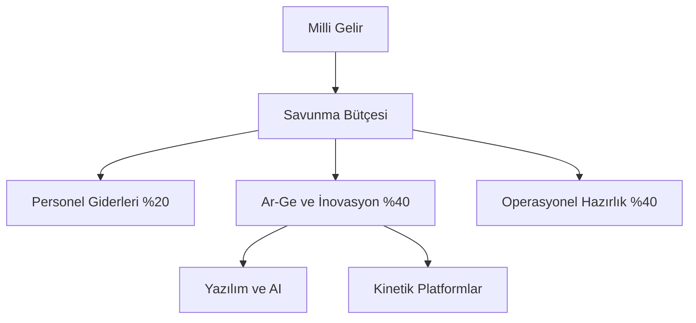

# 🏛️ Milli Savunma Yüksek Konseyi (MSYK)
## ⟨ Stratejik Planlama Direktörlüğü: UMF-MSYK-01 ⟩

### 1. Vizyon ve Projeksiyonlar
MSYK Stratejik Planlama Direktörlüğü, devletin beka stratejisini 10, 20 ve 50 yıllık periyotlarla günceller. Bu doküman, UMF yapısının en üst düzey karar destek mekanizmasını tanımlar.

#### 📈 Tehdit Projeksiyon Matrisi
| Zaman Dilimi | Birincil Tehdit Odagı | Teknolojik Gereksinim | Stratejik Beklenti |
| :--- | :--- | :--- | :--- |
| **10 Yıl** | Bölgesel Hibrit Savaşlar | İHA/SİHA Sürüsü ve EW | Tam Sınır Güvenliği |
| **20 Yıl** | Siber-Fiziksel Altyapı Saldırıları | Kuantum Kriptoloji ve AI Savunma | Enerji ve Veri Bağımsızlığı |
| **50 Yıl** | Uzay Tabanlı Güç Rekabeti | LEO/MEO Silah Sistemleri | Uzay Hukuku ve C2 Hakimiyeti |

---

### 2. Milli Kaynak Tahsis Protokolü
Savunma bütçesinin dinamik olarak yönetilmesi, "The Nerve" sisteminden gelen veri akışıyla optimize edilir.

### 3. Karar Mekanizması (Siyasi-Askeri Entegrasyon)
MSYK, siyasi iradenin hedeflerini askeri direktiflere dönüştürürken şu parametreleri esas alır:
- **Jeopolitik Risk Analizi**: Komşu devletlerin askeri hareketliliği.
- **Ekonomik Sürdürülebilirlik**: Savaş ekonomisi senaryolarının sivil toplum üzerindeki etkisi.
- **Teknolojik Yerlilik**: Kritik sistemlerde dışa bağımlılığının sıfırlanması.

---
*Referans: UMF-MSYK-01-V1.0*
*Sınıflandırma: Milli Stratejik Master-Plan*
